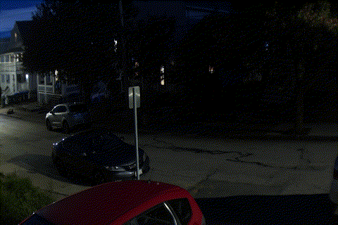

# pi-timelapse
Timelapse using picamera2, with S3 upload option for months or years long timelapses.

This is intended to run on a raspberry pi. Using python, we are able to take pictures and save them in a specific location. Using [FFMPEG](https://www.ffmpeg.org/) you can compile the pictures into a timelapse.

1. ```timelapse.py``` is run as a command with the desired arguments
2. ```timelapse-config.py``` is run as a command but will search for a file ```config.yaml``` to load desired timelapse parameters.

# Installation
1. To install required dependencies run ```pip3 install -r requirements.txt```

# Commands
## timelapse.py
Run as ```python3 timelapse.py "project_name"``` to start with default parameters.

To view other parameters run: ```python3 timelapse.py --help```

List of parameters:
1. Project name
2. Path: Where to save images to
3. Interval: interval between images in seconds
4. Number: total number of images to save, -1 for continuous
5. Width: Pixel resolution width
6. Height: Pixel resolution height
7. Night Mode: To take pictures at night with long exposure time
8. Exposure: Exposure time in micro-seconds

## timelapse-config.py
Run as ```python3 timelapse-config.py "config_file_name"```.

View ```config.yaml``` to see a template config file.

# How to create a timelapse

I recommend using [FFMPEG](https://www.ffmpeg.org/) to compile the images into a timelapse. 

For example, if your images are located in "first_project":

```ffmpeg -framerate 10 -pattern_type glob -i "first_project/*.jpeg" output.mp4 ```

Note that globbing expressions only work in Linux. For Windows, you might have to do something like [this.](https://superuser.com/questions/902961/ffmpeg-windows-binaries-with-globbing-libavformat-support)

# Running from Cron
Use a cron job to schedule execution of the timelapse. Read more about [crontab](https://www.tutorialspoint.com/unix_commands/crontab.htm).


For example: To run a python virtual environment timelapse.py at 9 PM, called first_project
```
0 21 * * * /home/pi/Projects/pi-timelapse/venv/bin/python3 /home/pi/Projects/pi-timelapse/timelapse.py first_project
```

For example: To run a python virtual environment timelapse.py at reboot, called continuous
```
@reboot /home/pi/Projects/pi-timelapse/venv/bin/python3 /home/pi/Projects/pi-timelapse/timelapse.py first_project
```

# Example


# Contribution
1. To contribute open a pull request to ```dev```
2. Or create an issue if you would like something developed